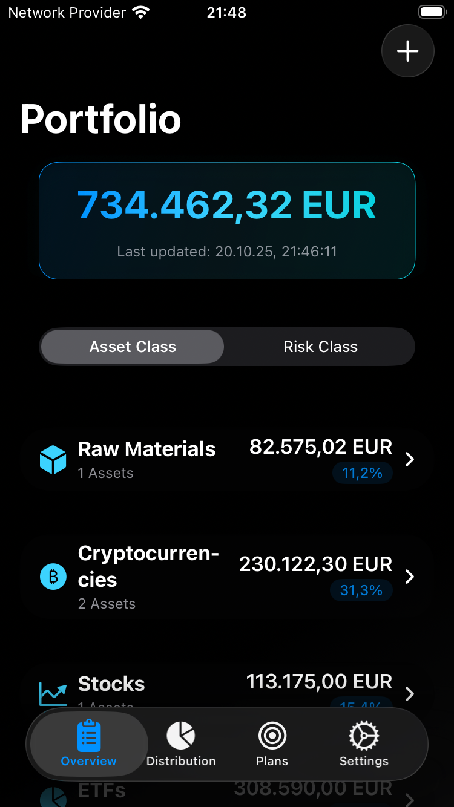

# FinancialOverview

*Random asset amounts used in preview images.*

<p align="center">
  
  
  
  
</p>

## Overview
A comprehensive SwiftUI-based iOS portfolio management application that enables users to track and analyze their financial assets across multiple categories including cryptocurrencies, stocks, ETFs, and raw materials. The app provides real-time price updates, advanced portfolio analytics, investment planning tools, and robust data management features with a modern dark theme interface.

## ✅ Implemented Features

### 📱 User Interface
- **Four-tab interface**: Portfolio Overview, Distribution Charts, Investment Plans, and Settings
- **Dark theme design** with gradient accents and modern styling
- **Privacy mode** with automatic value hiding and manual reveal options
- **Responsive layout** with smart decimal formatting for asset amounts
- **Pull-to-refresh** functionality for manual price updates
- **Expandable sections** for better organization
- **Interactive charts** using SwiftUI Charts framework

### 📊 Portfolio Overview Tab
- **Total portfolio value display** with prominent gradient styling
- **Dual view modes**: Asset Class view and Risk Class view
- **Asset categorization** by class (Raw Materials, Cryptocurrencies, Stocks, ETFs)
- **Risk classification** system (High, Medium, Low risk categories)
- **Expandable asset sections** showing totals, percentages, and individual assets
- **Asset management** with tap-to-edit functionality
- **Add new assets** with comprehensive form including risk assessment
- **Delete assets** with swipe-to-delete gesture
- **Visual indicators** with appropriate icons for each asset class and risk level

### 📈 Distribution Tab
- **Interactive pie charts** showing portfolio distribution
- **Toggle between Asset Class and Risk Class views**
- **Real-time percentage calculations**
- **Visual breakdown** of portfolio allocation
- **Modern chart animations** and transitions

### 🎯 Plans Tab
- **Investment plan creation** and management
- **Target allocation planning** by Asset Class or Risk Class
- **Plan validation** with percentage totals
- **Rebalancing recommendations** with mathematical optimization
- **Plan analysis** showing current vs target distributions
- **Interactive charts** comparing current and target allocations
- **Smart rebalancing calculations** (addition-only, no selling required)

### ⚙️ Settings Tab
- **Privacy Mode** with automatic value hiding and timer-based reveal
- **Currency selection** (USD/EUR) with segmented picker
- **Asset class filtering** - enable/disable specific asset types
- **CSV Import/Export** functionality for portfolio data
- **Version and developer information**
- **Data management** with file picker integration

### 🏗️ Data Architecture
- **Local persistence** using UserDefaults with JSON encoding
- **MVVM architecture** with Observable view models
- **Real-time updates** using async/await patterns
- **Complete asset replacement** during import (overwrites existing data)
- **Privacy-focused design** with optional value hiding
- **Asset class filtering** system for customizable views

### 💰 Asset Management
- **Four asset classes** supported:
  - Raw Materials (e.g., Gold - XAU, Silver - XAG)
  - Cryptocurrencies (e.g., BTC, ETH)
  - Stocks (using ISIN codes)
  - ETFs (using ISIN codes)
- **Three-tier risk classification** system (High, Medium, Low)
- **Flexible quantity tracking** with smart decimal display
- **Real-time price fetching** from multiple API sources
- **Asset deduplication** when adding existing assets
- **Individual asset editing** with risk category assignment

### 🔒 Privacy Features
- **Privacy Mode** toggle for hiding sensitive financial data
- **Automatic value hiding** when app goes to background
- **Manual reveal** with eye icon toggle
- **10-second auto-hide timer** after manual reveal
- **Configurable privacy settings** in Settings tab

### 🎯 Investment Planning
- **Custom investment plans** with target allocations
- **Two planning modes**: Asset Class based or Risk Class based
- **Mathematical rebalancing optimization** 
- **Addition-only rebalancing** (no selling required)
- **Visual plan analysis** with current vs target comparisons
- **Plan validation** ensuring 100% allocation
- **Historical plan tracking** with creation and modification dates

### 📊 Advanced Analytics
- **Interactive pie charts** using SwiftUI Charts
- **Real-time percentage calculations** across all views
- **Distribution analysis** by asset class and risk category
- **Rebalancing recommendations** with precise amounts
- **Portfolio optimization** suggestions

### 🌐 API Integration
- **CryptoCompare API** for cryptocurrency prices
- **JustETF API** for ETF and stock pricing via ISIN
- **SwissQuote API** for raw material prices
- **Multi-currency support** (USD/EUR)
- **Error-resilient** network requests with proper error handling

### 📊 Data Import/Export
- **CSV Export** with proper formatting and quotes
- **CSV Import** with validation and error handling
- **Asset replacement** during import (overwrites all existing assets)
- **Risk category support** in CSV format
- **File picker integration** for iOS document handling
- **Backward compatibility** with legacy CSV formats

### 🛠️ Technical Implementation
- **SwiftUI** with modern @Observable pattern
- **SwiftUI Charts** for interactive data visualization
- **Async/await** for all network operations
- **Type-safe** models with Codable support
- **Comprehensive error handling** throughout the application
- **iOS 26.0+** compatibility with latest SwiftUI features
- **Advanced mathematical algorithms** for portfolio optimization

## 📁 Project Structure

```
FinancialOverview/
├── FinancialOverviewApp.swift     # App entry point
├── ContentView.swift              # Main four-tab container
├── Models/
│   ├── Asset.swift                # Core asset data model with risk categories
│   ├── AssetClass.swift           # Asset type enumeration
│   ├── AssetCategory.swift        # Risk category enumeration  
│   ├── Currency.swift             # Currency enumeration
│   └── Plan.swift                 # Investment planning models
├── Services/
│   ├── APIService.swift           # Network service for price fetching
│   ├── PlanManager.swift          # Investment plan management
│   ├── PrivacyModeManager.swift   # Privacy and data protection
│   └── AssetClassSettingsManager.swift # Asset filtering preferences
├── ViewModels/
│   └── AssetViewModel.swift       # Main app state management
└── Views/
    ├── OverviewView.swift         # Portfolio overview with dual modes
    ├── DistributionView.swift     # Interactive pie charts
    ├── PlansView.swift            # Investment planning interface
    ├── PlanAnalysisView.swift     # Plan analysis and rebalancing
    ├── AddPlanView.swift          # Plan creation/editing
    ├── SettingsView.swift         # Settings and data management
    ├── AssetEditView.swift        # Asset creation/editing form
    └── BlurredValueModifier.swift  # Privacy UI modifier
```

## 🚀 Build & Run Instructions

### Using Xcode (Recommended)
1. Open `FinancialOverview.xcodeproj` in Xcode 15.0+
2. Select your target device (iPhone simulator or physical device)
3. Build and run: ⌘+R

### Using Command Line
The project includes automated deployment scripts:

**For iOS Simulator:**
```bash
./deploy_to_simulator.sh
```

**For Physical iPhone:**
```bash
./deploy_to_iphone.sh
```

**Using Manual Build Command:**
```bash
xcodebuild -project FinancialOverview.xcodeproj \
           -scheme FinancialOverview \
           -destination "platform=iOS Simulator,name=iPhone SE",OS=26.0 \
           -configuration Debug \
           build
```

## 🧪 Testing

The project includes API testing functionality:

**Run API Tests:**
```bash
./test_api_services.sh
```

Or compile and run the test runner:
```bash
swift APIServiceTests.swift
```

## 💾 Data Management

### CSV Format
The app supports CSV import/export with the following format:
```csv
Asset Class,Code,Name,Amount,Risk Class
"Cryptocurrencies","BTC","Bitcoin",0.5,"High"
"Stocks","US0378331005","Apple",100,"Medium"
"ETFs","IE00B5BMR087","iShares Core MSCI World",50,"Low"
"Raw Materials","XAU","Gold",2,"Low"
```

### Privacy and Data Protection
- All financial data stored locally in iOS UserDefaults
- Privacy Mode automatically hides values when app backgrounds
- Manual reveal with 10-second auto-hide timer
- No data transmitted to external servers except for price updates
- Configurable asset class visibility settings

## 🔮 Future Enhancements

- **Historical price tracking** and portfolio performance charts
- **Price alerts** and push notifications
- **More asset classes** (bonds, real estate, commodities)
- **Advanced portfolio analytics** (Sharpe ratio, volatility analysis)
- **Cloud sync** with encrypted data storage
- **Multiple portfolio support** for different investment strategies
- **Automated rebalancing suggestions** with calendar integration
- **Tax optimization** features and reporting

## ⚙️ Development Setup

### Requirements
- Xcode 15.0 or later
- iOS 26.0 or later
- Swift 5.9 or later
- SwiftUI Charts framework

### API Configuration
The app currently uses public APIs:
- **CryptoCompare**: No API key required for basic usage
- **JustETF**: Public API endpoints
- **SwissQuote**: Public quotes endpoint

For production use, consider implementing proper API authentication and rate limiting.

### Development Scripts
- `deploy_to_simulator.sh` - Automated iOS Simulator deployment
- `deploy_to_iphone.sh` - Automated physical device deployment  
- `test_api_services.sh` - API service testing
- See `DEVELOPMENT.md` for detailed build instructions

## 📋 Architecture Notes

- **Reactive UI**: Uses SwiftUI's @Observable for automatic UI updates
- **Privacy by Design**: Built-in data protection and user privacy controls
- **Mathematical Optimization**: Advanced algorithms for portfolio rebalancing
- **Error Resilience**: Graceful handling of network failures and edge cases
- **Data Persistence**: UserDefaults for simplicity, easily extensible to Core Data
- **Modular Design**: Clear separation between models, views, and services
- **iOS Guidelines**: Follows Apple's Human Interface Guidelines and modern SwiftUI patterns

## 📄 License

MIT License - see `LICENSE` file for details.

## 👨‍💻 Developer

**Martin Knoche**
- Email: financialoverview@martinknoche.net
- GitHub: [@Martlgap](https://github.com/Martlgap)

The app provides a comprehensive foundation for personal portfolio management with advanced planning features, privacy protection, and room for enterprise-grade enhancements.
